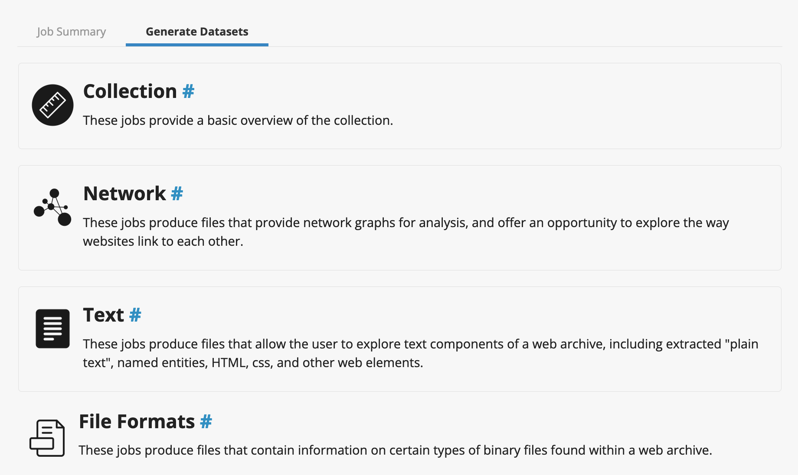

# All Our Yesterdays
A toolkit to explore Web Archives

## Purpose

This utility is used for getting derivatives of WARC files into a structured Colab environment for analysis and further export. 

## Preparation

Two options are available to get your data ready

- Create your own derivative directly in the [ARCH interface](https://webdata.archive-it.org/ait/login) and save it to a folder in **Google Drive**
- Create a _dervivative_ of any `WARC` file you have using the AOY Derivative Creation Notebook, which will save it to **Google Drive** for use by the **Analysis** Notebooks. 

 - Derivative Generator

## Analysis

Premade Notebooks to analyze different derivative types are outlined in the following chart. These types are based on the output of [ARCH](https://support.archive-it.org/hc/en-us/articles/360061122492-Introduction-to-the-Archive-It-Research-Services-Cloud). General categories are in **figure 1**. 

|Category   |Notebook Topic   | Launch    |
|---|---|---|
|Collection|   |   |
|    |    |     |
|Network|   |  |
|   |Graph Analysis   |    |
|Text   |   |   |
|   |Basic Text Analysis   |    |
|   |Topic Modeling   |    |
|File Formats|   |   |
|    |    |     |

