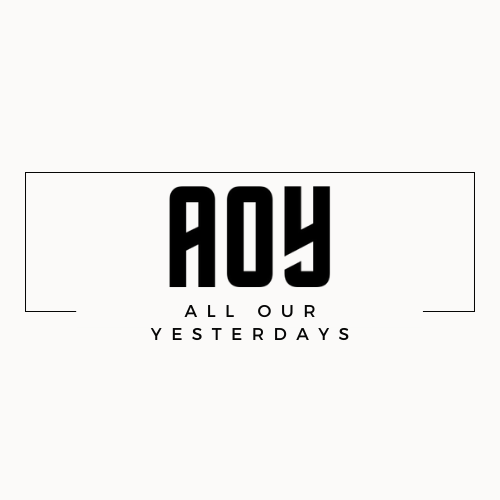

# All Our Yesterdays
A toolkit to explore the contents of Web Archives. For more information and an overview of the platform please watch a short [video]() on how it works. Most of what AOYTK can do is built on the derivative output of [ARCH](https://support.archive-it.org/hc/en-us/articles/360061122492-Introduction-to-ARCH) and/or  [AUT](https://archivesunleashed.org/aut/) but it can easily to modified to work with other derivatives.

## Where are my files saved?

By default all of the files generated by **All Our Yesterdays** are saved in the top level of your Google Drive in a folder called `AOY`. Every time you run AOYTK it will ask you to set this directory.

## Preparation

Two options are available to get your data ready

- Create your own derivative directly in the [ARCH interface](https://webdata.archive-it.org/ait/login) and save it to a folder in **Google Drive**
- Create a _derivative_ of any `WARC` file you have using the AOY Derivative Creation Notebook, which will save it to **Google Drive** for use by the **Analysis** Notebooks. 

 - Derivative Generator

## Analysis

Premade Notebooks to analyze different derivative types are outlined in the following chart. These types are based on the output of [ARCH](https://support.archive-it.org/hc/en-us/articles/360061122492-Introduction-to-the-Archive-It-Research-Services-Cloud). General categories are in **figure 1**. 

|Category   |Notebook Topic   | Launch    |
|---|---|---|
|Collection|   |   |
|    | Collection Analysis   |     |
|Network|   |  |
|   |Graph Analysis   |    |
|Text   |   |   |
|   |Basic Text Analysis   |    |
|   |Topic Modeling   |    |

## Export

If you don't like the Colab environment CSV representations of your data will be saved to the **Google Drive** so that you can download them to use in different tools.

**figure 1.**

## Documentation

[About](html/about.md) - A quick look at the project.

[API Docs](html/aoytk.md) - Listing of all of the objects and functions in the **aoytk** object 
